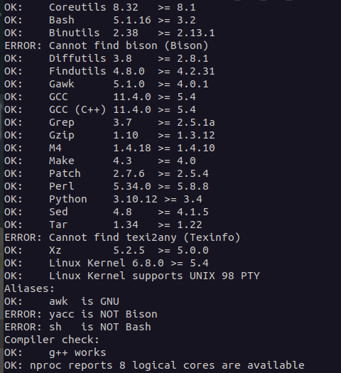
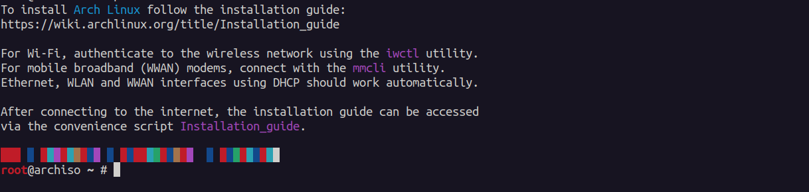

# Linux_From_Scratch_System
My custom Arch Linux from Scratch System developmental guide for **x86_64 bit architecture**.

Based on -> [LFS: Version 13.0-systemd](https://www.linuxfromscratch.org/lfs/)

> "I solemnly swear to mess up my working system just for the sake of learning purposes".
                                                                - Unknown Arch user


## Prepare the Host System

**Requirements**: A *Host System other than* the developmental system.

> If you don't have 2 systems, can develop your linux system *on a virtual machine*.

### Check Host Requirements
There is a *script written to check host system requirements (**available in the repository**)*.

> Run the script **host_sys_req_checker.sh**<br>
> ``` $ chmod +x path/to/host_sys_req_checker.sh ```<br>
> ``` $ path/to/host_sys_req_checker.sh ```<br>


> Install any packages which *isn't **up-to-date** or **downloaded***.

### Connect to Linux System:
1. Boot the installation package|iso.

*after booting, it should look similar*
2. Find out the ip address of your machine.
``` $ ip a ```
3. SSH into the terminal from your host machine.
``` $ ssh hostname@<ip-address> ```<br>
eg. 
    $ ssh root@10.192.245.12

### Additional Steps: (for virtual machine users)
*SSH part is slightly different for vm users (**rest of steps are same**)*

1. Perform **Port Forwarding**<br>
    eg. Host Port -> 3022 (*listens all the activity at Guest Port*)<br>
        Guest Port -> 22 (*std. port for SSH*)
2. Now can perform *ssh from host to virtual machine.*
``` $ ssh -p <Host_Port> hostname@<loop_back_address> ```<br>
eg. 
    $ ssh -p 3022 root@127.0.0.1


## Partition

### Designing Disk Partitions

**Tradeoff (Simplicity or Separation)**: 
* Single Large Partition (simple,flexible, easy to manage)
    * failure
    * corruption
    * application growth
* Multiple Partitions (complex, hard but better)
    * sizing mistakes
    * mount ordering
    * update logic
    * recovery logic
    * operational maintenance

**Question to ask when designing**:
* where does *rootfs* live ?
* is *rootfs* r or r/w ?
* need 1 rootfs or 2 rootfs slots for an A/B update model?
* where does logs, configuration, runtime data, caches, and application data go ?
* what needs to survive **reboot**, **rollback**, or **factory reset** ?
* what needs to *encrypted separately* ?
* what needs to be **backed up**, **restored**, or **wiped independently** ?


